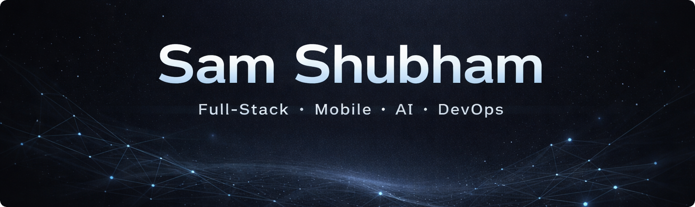

  

# Sam Shubham

Building apps people use & backend systems that scale.  
Full-Stack • Mobile • AI • DevOps

---

## What I Work On

- Scalable backend systems (Node.js / Express)
- Cross-platform mobile apps (React Native / Expo)
- DevOps & infrastructure (Linux, Docker, Nginx)
- AI-powered tools and automation
- Open-source contributions (Expo, VSCode ecosystem, data tooling)

---

## Currently

- Contributing to open-source projects
- Working on ML/AI systems
- Exploring performance and systems-level improvements

## 🌐 Socials:

---

# 💻 Tech Stack:

### Core

### Frontend & Mobile

### Backend

### Databases

### DevOps & Systems

---
 
 

### Top Contributions

